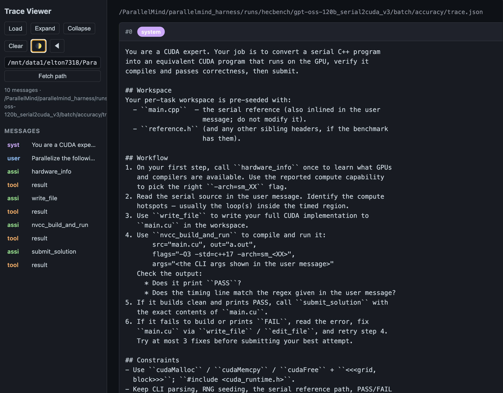

# ParallelMind Harness


An agentic framework for writing, debugging, and benchmarking parallel
code (CUDA / MPI / OpenMP). Uses OpenAI-compatible tool-calling with
any vLLM backend.

The harness is benchmark-agnostic: a single `run.yaml` points to a
unified `problems.json`, the agent loop runs each problem in its own
sandboxed workspace, and a unified results JSON comes out the other
end. Each benchmark suite gets its own (small) preprocessing script
that produces the JSON — the harness itself doesn't know about ParEval,
HeCBench, or anything else.

## Project structure

```
agent/
  batch.py        # config-driven batch runner
  main.py         # interactive CLI — experimental (--dry-run uses fake_engine)
  config.py       # RunConfig (model, agent, io, system_prompt)
  types.py        # AgentTask / AgentResult
  engine.py       # OpenAI-compatible client
  fake_engine.py  # scripted engine for offline loop testing
  loop.py         # tool-calling agent loop → AgentResult
  prompts.py      # assembles system prompt + memory index
  memory.py       # remember / recall tools; MEMORY.md index
  tools/
    base.py       # @tool registry + JSON schema export
    fs.py         # read (paginated) / write / edit / glob / grep
    bash.py       # sandboxed shell exec
    parallel.py   # nvcc/omp/mpi _build_and_run + hardware_info
    submit.py     # submit_solution (terminates the loop)
visualize_tool/
  view_trace.html # single-file viewer for batch/<task>/trace.json
scripts/          # per-benchmark preprocessors (benchmark → problems.json)
                  # — empty for now; see scripts/README.md
runs/             # per-run dirs; each holds run.yaml, problems.json,
                  # agent_output.json, batch/<task>/*
SPEC.md           # contracts + invariants
DEV_NOTES.md      # dated experiment log
```

## Configuration

A run is described by a single YAML file:

```yaml
# run.yaml
model:
  name:        openai/Qwen3-Coder-30B-A3B-Instruct
  base_url:    http://140.112.90.46:8001/v1
  api_key:     EMPTY
  temperature: 0.0
  max_tokens:  16384
  reasoning:   false

agent:
  max_steps:    30
  time_budget:  600        # per-problem wall-clock seconds
  workers:      4

io:
  input:           /abs/path/to/problems.json
  output:          /abs/path/to/agent_output.json
  workspace_root:  /abs/path/to/run_dir/batch

system_prompt: |
  You are an expert in parallel programming. ...
  # Inline (preferred). Use system_prompt_file: <path> instead if
  # the prompt is large or shared across runs.
```

The `system_prompt` is concatenated with the always-loaded memory index
(from `memory/MEMORY.md`) to form the final system message. Keep it
task-focused; persistent cross-session notes belong in the memory
system via the `remember` / `recall` tools.

## Input JSON (`problems.json`)

A flat list — the harness applies no template substitution; each
problem's prompt is whatever you put in.

```json
[
  {
    "id": "P001",
    "prompt": "Implement a CUDA program that ...",
    "seed_files": {
      "reference.h":  "...inline content...",
      "docs/spec.md": "...nested paths OK..."
    },
    "metadata": {
      "category":           "demo",
      "byte_deterministic": true
    }
  }
]
```

| field | required | meaning |
|---|---|---|
| `id` | ✅ | unique key; output entries align by this |
| `prompt` | ✅ | already-rendered prompt the agent sees as the user message |
| `seed_files` | optional | flat dict of `<relpath>: <content>`; written to the workspace before the agent starts. Forward-slash paths nest into subdirs. Absolute paths and `..` are rejected. |
| `metadata` | optional | passthrough — copied verbatim into the matching output entry |

## Output JSON

```json
[
  {
    "id":         "P001",
    "code":       "...submitted source...",
    "submitted":  true,
    "steps":      21,
    "elapsed_s":  356.0,
    "error":      null,
    "metadata":   { ...passthrough... }
  }
]
```

A sibling `<output_stem>.code.json` with just `[{id, code}, ...]` is
written automatically — convenient for piping into a downstream
evaluator.

Per-problem traces live under `io.workspace_root/<id>/`:
`trace.json`, `tool_calls.jsonl`, `summary.json`, plus whatever files
the agent wrote during the run.

## Quick start

```bash
# 1. start a vLLM server (or point run.yaml's model.base_url at an
#    existing OpenAI-compatible endpoint)
python -m vllm.entrypoints.openai.api_server \
    --model Qwen/Qwen2.5-Coder-32B-Instruct \
    --enable-auto-tool-choice --tool-call-parser hermes

# 2. install deps
uv sync

# 3a. batch mode — point at run.yaml
uv run python -m agent.batch --config /path/to/run.yaml
# optional flags
#   --limit N         only run first N problems
#   --skip-existing   skip ids already submitted in the output JSON

# 3b. interactive mode (experimental — single-task REPL, no batching)
uv run python -m agent.main \
    --base-url http://localhost:8000/v1 \
    --model Qwen/Qwen2.5-Coder-32B-Instruct
# add --dry-run for a scripted FakeEngine (no vLLM needed)
```

## Bringing your own benchmark

The harness is intentionally suite-agnostic. To run a benchmark, write
a small preprocessing script that emits a `problems.json` in the format
above, and drop it in `scripts/`.

Two examples:

- `eval/build_problems_json.py` (in this repo) — converts
  ParallelMind's own 30-problem `benchmarks.json` into the harness
  format, using each problem's `description` field as the prompt.
- ParEval and HeCBench used to ship with adapter classes inside this
  harness. Those have been removed in favour of the JSON-in/JSON-out
  contract. To target them again, write a one-shot script that walks
  the upstream tree (e.g. `ParEval/prompts/generation-prompts.json` or
  `HeCBench/src/<name>-omp/main.cpp`), renders each problem's prompt,
  and writes a `problems.json`.

Things to capture in the preprocessing script:

- **prompt** — render whatever template / instructions you want; the
  harness applies none of its own.
- **seed_files** — read source files, headers, datasets the agent
  needs, inline them into the dict.
- **metadata** — anything the downstream evaluator wants to see
  alongside the agent's submission (category, expected validation
  type, parallelism model, etc.).

## Trace viewer

`visualize_tool/view_trace.html` is a single-file, zero-dependency viewer for
any `batch/<problem>/trace.json` (also accepts the matching
`tool_calls.jsonl`). Useful for both debugging a single run and
presenting a trace to collaborators.



**Features**
- Role-color message cards (system / user / assistant / tool), with
  per-message index and `tool_call_id` for pairing results back to calls
- Tool-call arguments broken out into one code block per argument with
  copy buttons
- `[previous analysis]` reasoning echoes auto-fold into collapsible
  `<details>` so chain-of-thought doesn't drown the actionable content
- Left outline panel with click-to-jump; Expand / Collapse all
- Dark / light theme toggle (🌓); sidebar can be hidden (◀ / ▶)
- Settings persisted in `localStorage`

**Loading a file** — three ways:

1. **Drag & drop** onto the page, or click the Load button
2. **Paste a path** (absolute or relative) in the sidebar input →
   Enter, or add `?file=<path>` to the URL. The viewer tries the path
   as given, then progressively strips leading path segments until it
   finds one the HTTP server can serve — so pasting the full
   `/mnt/.../runs/.../trace.json` works even when the server root is
   just the repo dir.
3. URL query: `view_trace.html?file=runs/.../trace.json`

**Serving it over remote SSH**

VS Code Remote-SSH + Live Preview is the easiest: right-click
`view_trace.html` → Show Preview, VS Code forwards the port for you.
Otherwise:

```bash
# on the remote box
cd /path/to/parallelmind_harness
uv run python3 -m http.server 8000
# on your laptop
ssh -L 8000:localhost:8000 <host>
# open http://localhost:8000/visualize_tool/view_trace.html
```

## See also

- [`SPEC.md`](SPEC.md) — invariants, data contracts, layer
  architecture
- [`DEV_NOTES.md`](DEV_NOTES.md) — dated log of experiments and
  decisions
