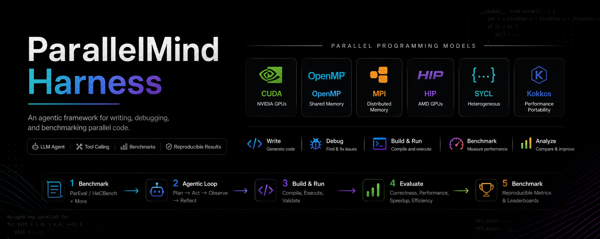

# ParallelMind Harness



An agentic framework for writing, debugging, and benchmarking parallel code
(CUDA / MPI / OpenMP). Uses OpenAI-compatible tool-calling with any vLLM
backend.

This README is a tutorial-style guide. For contracts, invariants, data
types, and the layer architecture, see [`SPEC.md`](SPEC.md).

## Project structure

```
agent/
  adapters/
    base.py              # AgentTask, AgentResult, BenchmarkAdapter ABC
    pareval.py           # ParEval adapter (ingest + normalize + export)
    hecbench.py          # HeCBench adapter (serial → parallel framing)
  config.py              # YAML config loaders (AgentConfig + per-bench)
  engine.py              # OpenAI-compatible client
  loop.py                # tool-calling agent loop → AgentResult
  batch.py               # adapter-driven batch runner (+ seed_dir support)
  main.py                # interactive CLI
  prompts.py             # assembles task-prompt + memory index
  memory.py              # remember / recall tools; MEMORY.md index
  tools/
    base.py              # @tool registry + JSON schema export
    fs.py                # read (paginated) / write / edit / glob / grep
    bash.py              # sandboxed shell exec
    parallel.py          # nvcc/omp/mpi _build_and_run + hardware_info
    submit.py            # submit_solution (terminates agent loop)
scripts/
  run_pareval.py         # end-to-end agent: generate → eval → metrics
  run_bare.py            # bare-model baseline via ParEval's generator
  run_hecbench.py        # agent → scratch tree → autohecbench → compare
  gen_serial_hecbench.py # LLM-based serial code generator for HeCBench
  view_trace.html        # single-file viewer for batch/<task>/trace.json
benchmarks/              # clone benchmark repos here (gitignored)
  HeCBench/serial/       # LLM-generated serial sources (gitignored)
runs/                    # per-benchmark subdirs: pareval/, hecbench/
SPEC.md                  # contracts and invariants
```

## Configuration

Each run has two YAML files under `runs/<bench>/<run-name>/`
(`<bench>` = `pareval` or `hecbench`):

**`agent.yaml`** — model, agent, and task-specific system prompt:
```yaml
model:
  name: openai/gpt-oss-120b
  base_url: http://140.112.90.45:48011/v1
  api_key: EMPTY
  temperature: 0.0
  max_tokens: 16384
  reasoning: true   # echo the model's chain-of-thought back each turn

agent:
  max_steps: 30
  time_budget: 300
  workers: 10

system_prompt: |
  You are a helpful coding agent helping a programmer write parallel
  C++ in a local workspace. You have tools to read and write files,
  run shell commands, and compile+run parallel C++ (OpenMP / MPI /
  CUDA). Call `hardware_info` once on your first step to learn which
  GPUs and compilers are available.

  ## Workflow
  ...
```

The `system_prompt` is concatenated with the always-loaded memory index
(from `memory/MEMORY.md`) to form the final system message. Keep it
task-focused; persistent cross-session notes belong in the memory
system via the `remember` / `recall` tools.

**`config.yaml`** — benchmark-specific settings:
```yaml
# ParEval
problem_set: omp
launch_configs: runs/pareval/_shared/launch-configs.nosrun.json
build_timeout: 30
run_timeout: 120

# HeCBench (serial → parallel)
target: cuda                              # cuda / omp / hip / sycl
serial_root: benchmarks/HeCBench/serial   # output of gen_serial_hecbench.py
src_root: benchmarks/HeCBench/src         # reference CUDA/OMP/... tree
repeat: 5                                 # autohecbench -r
nvidia_sm: 89                             # RTX 4090 = sm_89; A100 = 80; H100 = 90
```

## Quick start

```bash
# 1. start a vLLM server
python -m vllm.entrypoints.openai.api_server \
    --model Qwen/Qwen2.5-Coder-32B-Instruct \
    --enable-auto-tool-choice --tool-call-parser hermes

# 2. install deps
uv sync

# 3. interactive mode
uv run python -m agent.main \
    --base-url http://localhost:8000/v1 \
    --model Qwen/Qwen2.5-Coder-32B-Instruct \
    --system-prompt-file path/to/task_prompt.txt   # optional
```

## Benchmarks

### ParEval

[ParEval](https://github.com/parallelcodefoundry/ParEval) is a 60-problem
benchmark covering OpenMP / MPI / CUDA / Kokkos / HIP / serial variants.
Each problem ships a starter-code signature, a reference implementation
(`baseline.hpp`), and a per-thread-count validation/perf driver.

ParEval uses a strict concat contract — the prompt ends with
`return_type name(args) {` and the driver does `prompt + "\n" + output`
before compiling. So `agent/adapters/pareval.py` does the heavy lifting
of stripping markdown fences, dropping any re-emitted signature
(canonicalized for whitespace / east-west const / `std::size_t`
variants), and keeping only the function body. See the module docstring
for details.

#### Known issues / local patches

**07_fft_fft_conjugate** — two bugs, both patched locally under
`benchmarks/ParEval/`; see the
[upstream issue by @tanakarin](https://github.com/parallelcodefoundry/ParEval):

1. `fftCooleyTookey` in `baseline.hpp` applies `std::conj` inside the
   recursion, which corrupts subsequent butterflies. Fixed by
   splitting the recursion from a single top-level conjugate pass.
2. The docstring example in all prompt variants shows plain `FFT(x)`
   but the reference returns `conj(FFT(x))`. Fixed by flipping the
   imaginary parts of the example output in `raw/fft/07_*/*`,
   `generation-prompts.json`, `baseline.hpp`, and `cpu.cc`.

If you re-clone ParEval, re-apply these patches or the agent will
appear to fail problem 07 even though its code is a correct FFT.

#### Scripts

`scripts/run_pareval.py` — end-to-end agent pipeline:

```bash
# 1. clone benchmark once
git clone https://github.com/parallelcodefoundry/ParEval benchmarks/ParEval

# 2. create a run directory
mkdir -p runs/pareval/my_run
# write runs/pareval/my_run/agent.yaml  (see Configuration above)
# write runs/pareval/my_run/config.yaml

# 3. run (agent → eval → metrics)
uv run python scripts/run_pareval.py --run-name my_run

# partial reruns
uv run python scripts/run_pareval.py --run-name my_run --skip-agent --skip-eval
uv run python scripts/run_pareval.py --run-name my_run --limit 3  # debug subset
```

Output layout under `runs/pareval/my_run/`:
```
agent.yaml          agent config (includes system_prompt)
config.yaml         benchmark config
system_prompt.txt   copy of agent.yaml's system_prompt (passed to subprocess)
agent_output.json   agent output (adapter-normalized, ready for eval)
results.json        ParEval eval output
results.csv         flattened dataframe
metrics.csv         build@1, pass@1, speedup@1, efficiency@1
batch/<problem>/    trace.json, tool_calls.jsonl, summary.json, solution.cpp, a.out
scratch/            ParEval eval scratch files
run.log             full stdout/stderr of the pipeline
```

`scripts/run_bare.py` — non-agent baseline that wraps ParEval's own
`generate-openai-vllm.py`. Uses the same `runs/<run>/{agent,config}.yaml`
schema (only `model.*` is read; `agent` and `system_prompt` are
ignored). Output is post-processed with the adapter's `normalize()` so
brace/signature handling matches agent mode and numbers stay
apples-to-apples.

```bash
uv run python scripts/run_bare.py --run-name bare_omp --num-samples-per-prompt 5
```

Both scripts call `verify_eval_complete()` before computing metrics —
if `run-all.py` was interrupted and any entry still has raw-string
outputs (indicating un-evaluated samples), the script aborts loudly
rather than silently dropping affected categories.

### HeCBench

[HeCBench](https://github.com/zjin-lcf/HeCBench) is a suite of ~500
full-program heterogeneous benchmarks (CUDA / HIP / SYCL / OpenMP).
Each one is a self-contained C++ program with a reference algorithm,
PASS/FAIL check, and a timing line the harness extracts via regex.

#### Task framing (serial → parallel)

Rather than "make this parallel code faster", we first generate a
**serial CPU reference** for each benchmark, then ask the agent to
parallelize it for a configured target (CUDA first).

```bash
# 1. clone benchmark
git clone https://github.com/zjin-lcf/HeCBench benchmarks/HeCBench

# 2. generate serial sources once (outputs benchmarks/HeCBench/serial/)
uv run python scripts/gen_serial_hecbench.py --workers 10

# 3. create a run dir + configs
mkdir -p runs/hecbench/my_run
# write agent.yaml + config.yaml  (see Configuration; target=cuda etc.)

# 4. run full pipeline
uv run python scripts/run_hecbench.py --run-name my_run

# partial reruns
uv run python scripts/run_hecbench.py --run-name my_run --skip-agent
uv run python scripts/run_hecbench.py --run-name my_run --skip-timing
uv run python scripts/run_hecbench.py --run-name my_run --limit 10
```

The orchestrator has four stages:

1. **Agent** — writes candidate parallel source per benchmark.
2. **Scratch tree** — mirrors `src/<name>-<target>/` →
   `scratch/<name>-<target>/` and substitutes the agent's source.
   Original benchmark dirs are never modified.
3. **Timing** — delegates to HeCBench's own `autohecbench.py`:
   runs against `src/` (baseline) and `scratch/` (candidate),
   producing `baseline.csv` and `candidate.csv`.
4. **Compare** — runs `autohecbench-compare.py`; writes
   `speedup.md` + merged `results.json` / `results.csv`.

The adapter (`agent/adapters/hecbench.py`) walks the serial tree, reads
each `.meta.json` for CLI args / regex / categories, and pre-seeds the
per-task workspace with `main.cpp` + `reference.h` (via
`metadata["seed_dir"]`) so the agent can compile + run immediately.
Target-specific toolchain hints (CUDA runtime API, OMP pragmas, HIP,
SYCL) are injected into the prompt so the model targets the right
toolchain without seeing the reference answer.

#### `gen_serial_hecbench.py`

LLM-based one-shot generator: for each `src/<name>-<src-model>/`
(default `omp`), pulls the main source(s) and asks the model to strip
all parallel directives and emit a plain single-threaded C++
equivalent. Output at `benchmarks/HeCBench/serial/<name>/main.cpp` +
`.meta.json` with test metadata copied from `benchmarks.yaml`. Sibling
headers (including cross-directory ones referenced via `-I../foo/` in
the Makefile) are copied too, so each serial dir compiles standalone
with plain `g++ -O3 -std=c++17 -I <dir>`.

Useful flags: `--workers N`, `--limit N` (debug subset), `--names a b c`,
`--categories x y`, `--overwrite` (regenerate even when the target file
already exists). Run `--help` for the rest.

A companion script `scripts/gen_hecbench_yaml.py` regenerates
`benchmarks/HeCBench/benchmarks.yaml` from upstream
`CMakeLists.txt` + `subset.json` (the upstream generator is broken).
Use `--check` to diff against the shipped yaml.

## Trace viewer

`scripts/view_trace.html` is a single-file, zero-dependency viewer for
any `batch/<problem>/trace.json` (also accepts the matching
`tool_calls.jsonl`). Useful for both debugging a single run and
presenting a trace to collaborators.

**Features**
- Role-color message cards (system / user / assistant / tool), with
  per-message index and `tool_call_id` for pairing results back to calls
- Tool-call arguments broken out into one code block per argument with
  copy buttons
- `[previous analysis]` reasoning echoes auto-fold into collapsible
  `<details>` so chain-of-thought doesn't drown the actionable content
- Left outline panel with click-to-jump; Expand / Collapse all
- Dark / light theme toggle (🌓); sidebar can be hidden (◀ / ▶)
- Settings persisted in `localStorage`

**Loading a file** — three ways:

1. **Drag & drop** onto the page, or click the Load button
2. **Paste a path** (absolute or relative) in the sidebar input →
   Enter, or add `?file=<path>` to the URL. The viewer tries the path
   as given, then progressively strips leading path segments until it
   finds one the HTTP server can serve — so pasting the full
   `/mnt/.../runs/.../trace.json` works even when the server root is
   just the repo dir.
3. URL query: `view_trace.html?file=runs/.../trace.json`

**Serving it over remote SSH**

VS Code Remote-SSH + Live Preview is the easiest: right-click
`view_trace.html` → Show Preview, VS Code forwards the port for you.
Otherwise:

```bash
# on the remote box
cd /mnt/data1/.../parallelmind_harness
uv run python3 -m http.server 8000
# on your laptop
ssh -L 8000:localhost:8000 <host>
# open http://localhost:8000/scripts/view_trace.html
```

## Adding a new benchmark

See the extension checklist in [`SPEC.md`](SPEC.md) §12. The short
version: write a `BenchmarkAdapter` (`load` + `export`), add a
`<Name>BenchmarkConfig` dataclass, register the adapter in
`agent/batch.py::ADAPTERS`, and write `scripts/run_<name>.py`.
